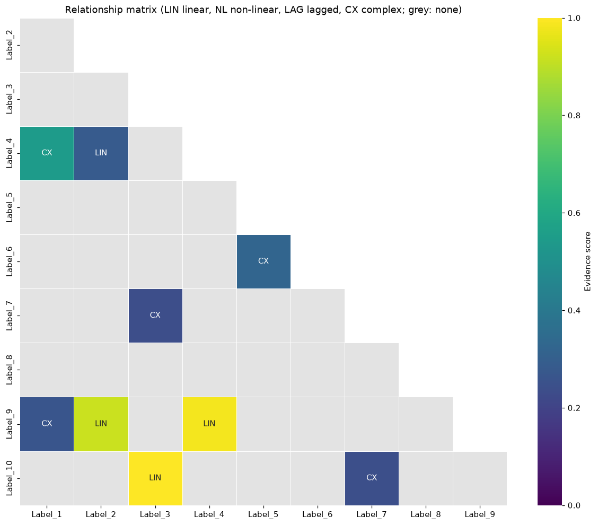
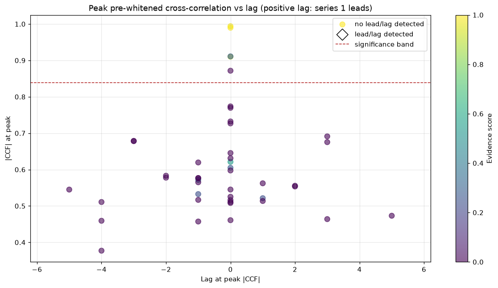

# TRACES

**Time-series Relationship Analysis with Comprehensive Evaluation Suite**

_A multi-method toolkit for finding, testing and classifying relationships between time series._

[](https://github.com/SwiftyProjects/TRACES/actions/workflows/ci.yml)
[](LICENSE)

[](https://github.com/astral-sh/uv)
[](https://github.com/astral-sh/ruff)

---

## Overview

Give TRACES a table of time series (Excel or CSV) and it analyses every pair:

- **Correlation**: Pearson, Spearman and Kendall, with significance tests that account for
  autocorrelation and for testing many pairs at once
- **Lead/lag**: a normalized, pre-whitened cross-correlation function (CCF) with significance bands
- **Stability**: rolling-window correlation
- **Classification**: `linear`, `non_linear`, `lagged`, `complex` or `none`, with an evidence score
  and recommended methods
- **Outputs**: tidy results table, Excel workbook, Markdown report and a visualization suite

It ships as a small Python package (`traces_ts`), a guided Jupyter notebook and a command-line tool.

> **Upgrading from v1?** Version 2 fixes several v1 defects and changes default statistics, so
> results differ. See the [CHANGELOG](CHANGELOG.md). `AnalysisConfig.classic()` gives v1-style results.

## Why the statistics matter

Classical p-values assume independent observations. Most real time series are autocorrelated, and
then those p-values are badly over-optimistic. In simulations with **independent** series of 52
points, the naive Pearson test called 51-67% of pairs significant (it should be 5%). TRACES v2
adjusts for this by default:

| Independent series (n=52) | naive p < 0.05 | TRACES v2 | naive lag detection | TRACES v2 |
|---|---|---|---|---|
| AR(1), phi = 0.95 | 55.7% | 6.2% | 43.2% | 1.5% |
| Random walks | 66.8% | 14.4% | 33.2% | 1.5% |
| Smoothed noise | 51.4% | 6.0% | 49.8% | 7.6% |

See [Formulae](docs/Formulae.md) for the methods and their limitations.

## Quick start

### 1. Install

```bash
git clone https://github.com/SwiftyProjects/TRACES.git
cd TRACES
uv sync --all-extras
```

Not using uv? Any virtual environment works:

```bash
python -m venv .venv
.venv/Scripts/activate          # Windows; use `source .venv/bin/activate` on macOS/Linux
pip install -e ".[notebook]"
```

A conda-forge `environment.yml` is also provided (`conda env create -f environment.yml`).

### 2. Run

**Notebook**: guided six-step walkthrough

```bash
uv run jupyter lab notebooks/TRACES_ES.ipynb
```

**Command line**: results, report and figures in one go

```bash
uv run traces analyze data/examples/TRACES_sample_52x10_dataset_A1.xlsx --out results
```

**Python**

```python
from traces_ts import AnalysisConfig, analyze, load_data, viz

data = load_data("data/examples/TRACES_sample_52x10_dataset_A1.xlsx")
result = analyze(data, AnalysisConfig(max_lag=8), exclude={"Label_1": ["Label_2"]})

result.top(10)  # strongest relationships
result.summary()  # headline statistics
viz.plot_relationship_matrix(result)  # figures return matplotlib Figures
result.to_excel("results/results.xlsx")
```

## Input format

| Time | Series_A | Series_B | ... |
|------|----------|----------|-----|
| 1    | 241.35   | 175.75   | ... |
| 2    | 240.25   | 175.06   | ... |

- `.xlsx`, `.xls` or `.csv`, one row per time point, in order
- The **first column is time** by default (numbers or dates); choose another with `time_column=`
- All other columns are numeric series; at least two series and three observations
- Missing values raise an error by default; use `missing="drop"` or `missing="interpolate"`
- Parent/child pairs (e.g. a total and its components) can be excluded with `exclude=`

## Example output

Relationship matrix and CCF overview for the bundled sample dataset
(full outputs in [docs/examples](docs/examples/)):

<p>
  
  
</p>

## Configuration

| Parameter | Default | Description |
|---|---|---|
| `rolling_window` | 12 | Observations per rolling-correlation window |
| `max_lag` | 10 | Lead/lag search range (both directions) |
| `alpha` | 0.05 | Significance level |
| `min_correlation` | 0.3 | Minimum strength to call a pair related |
| `detrend` | `"none"` | `"none"`, `"linear"` or `"difference"` |
| `autocorrelation_adjustment` | `True` | Effective-sample-size p-values |
| `fdr_correction` | `True` | Benjamini-Hochberg across pairs |
| `prewhiten` | `True` | AR pre-whitening before lag detection |

Classification thresholds are also configurable; see the
[Component Flexibility Guide](docs/ComponentFlexGuide.md).

## Project layout

```
TRACES/
├── src/traces_ts/        # package: io, stats, correlation, lags, classify, analysis, report, viz, cli
├── notebooks/            # TRACES_ES.ipynb walkthrough
├── tests/                # pytest suite, including statistical calibration tests
├── data/examples/        # two 52 x 10 sample datasets
├── docs/                 # guides, formulae and generated example outputs
└── scripts/              # generate_examples.py
```

## Documentation

- [Operational Guide](docs/OperationalGuide.md): installation, notebook, CLI and Python API
- [Component Flexibility Guide](docs/ComponentFlexGuide.md): what to tune and what not to
- [Mathematical Formulae](docs/Formulae.md): every statistic TRACES reports
- [Example outputs](docs/examples/): reports and figures for the sample datasets
- [CHANGELOG](CHANGELOG.md)

## Development

```bash
uv sync --all-extras
uv run pytest                          # tests
uv run pytest --nbmake notebooks       # execute the notebook
uv run ruff check . && uv run ruff format --check .
uv run python scripts/generate_examples.py
```

## Contributing

Contributions are welcome. Please open an issue or pull request; CI runs lint, tests on Python
3.11-3.14 and the notebook.

## License

MIT. See [LICENSE](LICENSE).

## Citation

If you use TRACES in your research, please cite it using the metadata in [CITATION.cff](CITATION.cff)
(GitHub's "Cite this repository" button), or:

```bibtex
@software{TRACES,
  author  = {SwiftyProjects},
  title   = {TRACES: Time-series Relationship Analysis with Comprehensive Evaluation Suite},
  version = {2.0.0},
  year    = {2026},
  url     = {https://github.com/SwiftyProjects/TRACES}
}
```
